


 

&nbsp;&nbsp;

&nbsp;&nbsp;

 

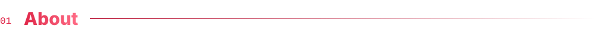


 

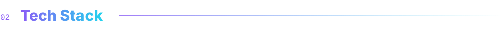


  

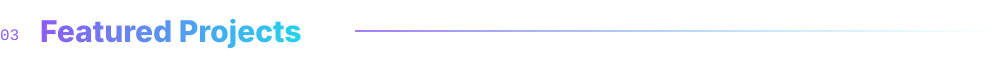

<a href="https://elow-store.vercel.app/">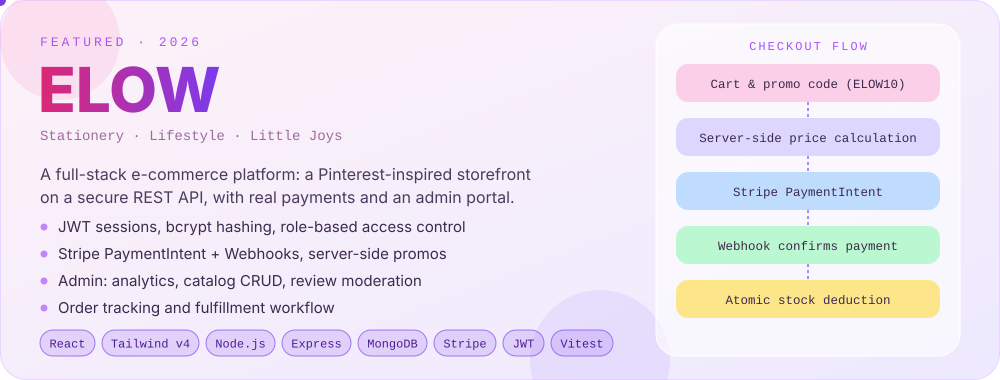</a>

&nbsp;&nbsp;

&nbsp;&nbsp;

 

<a href="https://meraki-ngo-platform.netlify.app/">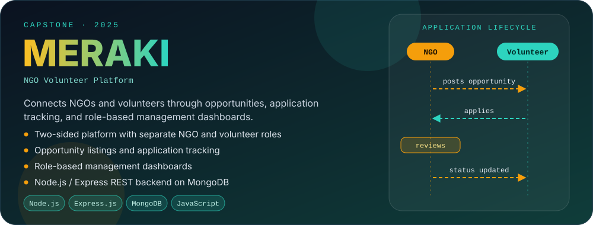</a>

&nbsp;&nbsp;

 

<a href="https://github.com/Megha-r20?tab=repositories">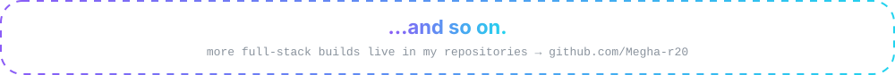</a>

  

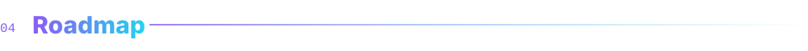

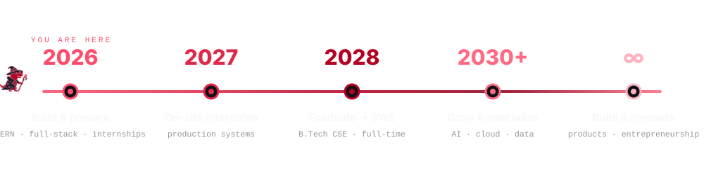

  

